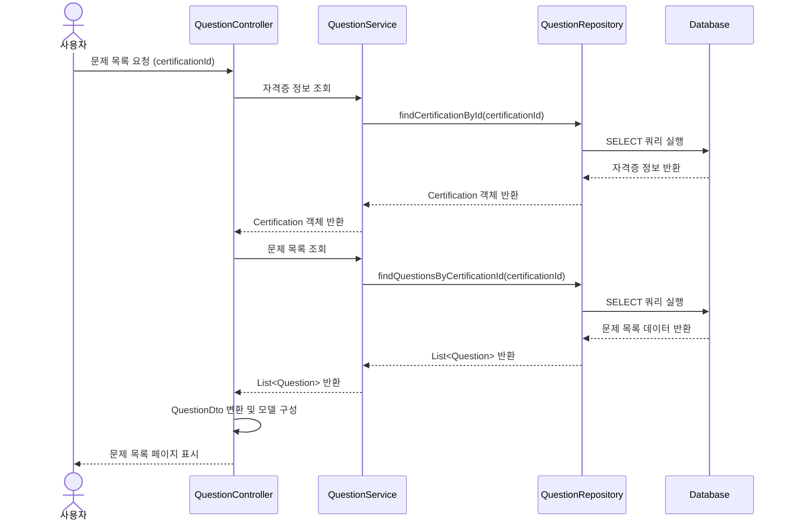
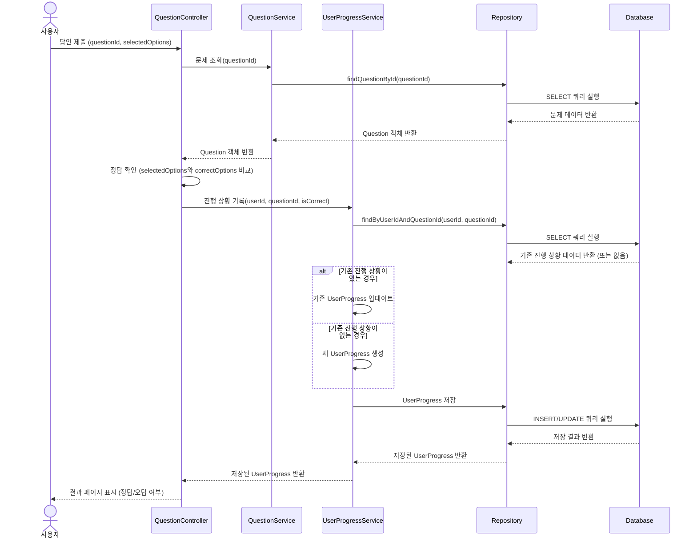

# AWS 자격증 학습 플랫폼

AWS 클라우드 자격증 준비를 위한 학습 및 문제 풀이 플랫폼입니다. 사용자는 다양한 AWS 자격증에 대한 문제를 풀고, 학습 진행 상황을 추적하며, 오답 노트를 관리할 수 있습니다.

## 애플리케이션 소개

이 플랫폼은 AWS의 다양한 자격증 시험 준비를 위한 종합적인 학습 도구입니다. 실제 시험과 유사한 환경에서 문제를 풀고, 개인별 학습 진행 상황을 추적하며, 취약한 부분을 집중적으로 학습할 수 있는 기능을 제공합니다.

### 주요 기능

- **자격증별 문제 은행**: 클라우드 프랙티셔너, 솔루션스 아키텍트 등 다양한 AWS 자격증 시험 대비 문제 제공
- **문제 풀이 모드**: 일반 모드와 랜덤 문제 모드를 통한 다양한 학습 방식 지원
- **학습 진행 상황 추적**: 풀어본 문제, 정답률, 오답 문제 등 학습 진행 상황을 시각적으로 확인
- **오답 노트 관리**: 틀린 문제를 자동으로 오답 노트에 추가하고 개인 메모 작성 가능
- **문제별 상세 설명**: 각 문제에 대한 정답 해설과 관련 개념 설명 제공
- **취약 영역 분석**: 정답률이 낮은 주제나 영역을 분석하여 집중 학습 유도

### 사용자 여정

1. 학습하고자 하는 AWS 자격증 선택
2. 해당 자격증의 전체 문제 목록 또는 랜덤 문제 세트 선택
3. 문제 풀이 및 즉각적인 피드백 확인
4. 오답에 대한 상세 설명 학습 및 필요시 메모 작성
5. 마이페이지에서 학습 진행 상황 및 취약 영역 확인
6. 오답 노트를 통한 반복 학습으로 취약 부분 보완

## 애플리케이션 스크린샷

### 메인 페이지

AWS 자격증 덤프 문제 메인 페이지로, 다양한 AWS 자격증 카테고리와 문제를 확인할 수 있습니다.

### 문제 리스트

AWS Certified Cloud Practitioner 자격증에 대한 문제 목록 페이지입니다. 총 642개의 문제 중 현재 1개의 문제를 풀어보았습니다.

### 자격증 상세 정보

AWS Certified Cloud Practitioner 자격증에 대한 상세 정보 페이지로, 시험 비용, 지원 언어, 학습 자료 등의 정보를 제공합니다.

### 문제 풀이 결과

정답을 맞췄을 때의 결과 화면입니다. 정답에 대한 설명과 함께 다음 문제로 넘어갈 수 있습니다.

### 오답 화면

오답을 선택했을 때의 결과 화면입니다. 정답과 함께 오답 노트에 추가할 수 있는 기능을 제공합니다.


오답 노트 페이지로, 사용자가 틀린 문제들을 모아볼 수 있고 재학습할 수 있습니다.

### 마이페이지

사용자의 학습 진행 상황을 한눈에 볼 수 있는 마이페이지입니다. 각 자격증별 전체 문제 수, 시도한 문제 수, 정답 문제 수를 확인할 수 있으며, 오답 노트에 추가된 문제를 바로 확인할 수 있습니다.

## 기술 스택

- **자바 버전**: Java 17
- **스프링부트 버전**: Spring Boot 3.2.3
- **데이터베이스**: MySQL, H2(개발용)
- **ORM**: Hibernate (Spring Data JPA)
- **프론트엔드**: Thymeleaf, Bootstrap
- **보안**: Spring Security

## 아키텍처 구조

이 프로젝트는 클린 아키텍처 패턴을 적용하여 설계되었습니다:

### 계층 구조

- **도메인 계층** (`domain`): 핵심 비즈니스 로직과 엔티티 포함
  - `entity`: 도메인 모델 (Question, Option, Certification, UserProgress 등)
  - `repository`: 데이터 액세스를 위한 인터페이스
  - `service`: 비즈니스 로직 정의 인터페이스

- **애플리케이션 계층** (`application`): 유스케이스 구현
  - `dto`: 데이터 전송 객체
  - `service`: 도메인 서비스 구현체

- **인프라스트럭처 계층** (`infrastructure`): 외부 시스템과의 통합
  - `security`: 보안 설정
  - `config`: 애플리케이션 설정

- **프레젠테이션 계층** (`presentation`): 사용자 인터페이스
  - `controller`: 웹 요청 처리
  - `advice`: 예외 처리

## 주요 기능 흐름

### 사용자가 문제 리스트 보기


### 정답/오답 처리 프로세스


## 개발 환경 설정

### 프로젝트 실행하기

```bash
./gradlew bootRun
```

### 테스트 실행하기

```bash
./gradlew test
```

## 추가 정보

- 개발 모드에서는 H2 인메모리 데이터베이스를 사용합니다.
- 프로덕션 환경에서는 MySQL 데이터베이스를 사용합니다.
- 자격증 및 문제 데이터는 초기 데이터 로드 스크립트를 통해 제공됩니다. 